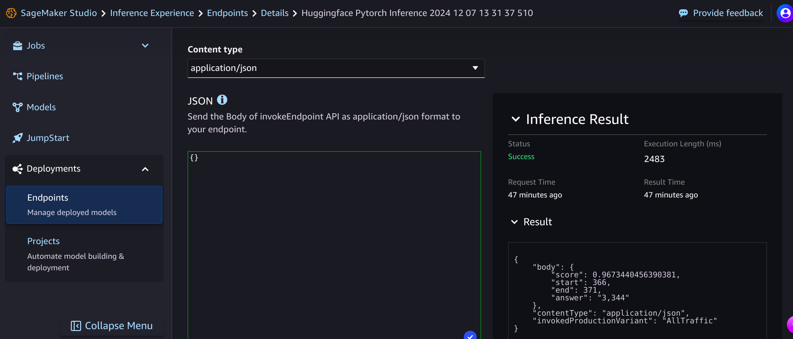

# HuggingFace Model Deployment on AWS Sagemaker

## Table of Contents
 * [Introduction](#introduction)
 * [Setup of AWS Sagemaker Studio](#setup-of-aws-sagemaker-studio)
 * [Run and Deploy the model](#run-and-deploy-the-model)
 * [Test Inference](#test--inference)
 * [Bug / Feature Request](#bug---feature-request)
 * [Techstack Used](#techstack-used)
 * [License](#license)

## Introduction
  This project is about using a huggingface model on the task of Question Answering and Deploying it on AWS Sagemaker Studio. First we create a bucket in AWS S3 where the model is stored. Then we configure for loading the model from the hub. Create IAM role with permissions to create an endpoint. Then the model is deployed to Sagemaker Inference.

## Setup of AWS Sagemaker Studio
1. Login to your AWS Account. Create a new one if you don't have account.
2. Open **AWS Sagemaker AI** service.
3. Set up Domain
4. A user profile will be created automatically
    
   Now, launch the Sagemaker Studio as shown here.
5. In the Sagemaker Studio, select Instance type and then click on Run Lab. You will be directed to the JupyterLab notebook.
    

## Run and Deploy the model
  Upload the [notebook](hf.ipynb) on the environment and run it. Choose the instance type as per the availability in your zone.

## Test Inference
  1. On the Sagemaker Studio, go to Deployments section and click on Endpoints. The page will show Endpoint Summary. Below that, click on 
     Test inference to perform the inference.
  2. Under the JSON column, give the input in the form of question and context. For example-
     ``` bash
     {
      "body": {
        "inputs": {
          "question": "How many indeginious territories exist in amazon rainforest?",
          "context": "The Amazon rainforest,also called Amazon jungle or Amazonia, is a moist broadleaf tropical rainforest in the Amazon 
           biome 
           that covers most of the Amazon basin of South America. This basin encompasses 7,000,000 km2 (2,700,000 sq mi), of which 6,000,000 
            km2 
           (2,300,000 sq mi) are covered by the rainforest. This region includes territory belonging to nine nations and 3,344 indigenous 
            territories."
                }
              },
           "contentType": "application/json",
        "endpointName": "huggingface-pytorch-inference-2024-12-07-13-31-37-510"
      }
      ```
     Refer to this image for reference.
       
      
     Refer to this image for the Inference result. The answer to the question is indicated by **"answer": "3,344"** meaning that the number 
     of indeginious territories is 3344.


     

## Bug / Feature Request
  If you find a bug (the website couldn't handle the query and / or gave undesired results), kindly open an issue [here](https://github.com/dhanushpittala11/HuggingFaceModelDeployment_AWS_Sagemaker/issues/new) by including your search query and the expected 
   result.

  If you'd like to request a new function, feel free to do so by opening an issue [here](https://github.com/dhanushpittala11/HuggingFaceModelDeployment_AWS_Sagemaker/issues/new). Please include sample queries and their corresponding results.

## Techstack Used
  ### Cloud and Storage
   #### AWS Services:
   * **Amazon SageMaker:** Used for deploying and managing machine learning models.
   * **Amazon S3:** Default bucket for storing data, models, and logs.
   * **IAM (Identity and Access Management):** For managing roles and permissions.
  ### Machine Learning Frameworks
   #### Hugging Face Transformers:
   * **Model:** distilbert-base-uncased-distilled-squad (question-answering task). Deployed using the Hugging Face Model class in SageMaker.
   * **PyTorch:** Backend framework for running the Transformer model.
  ### Programming
   * **Python:** Language for implementing the solution.
   * **JupyterLab/Jupyter Notebooks:** Likely used for development and testing in SageMaker Studio.
  ### Model Deployment
   * **SageMaker Inference:** Deployment of the Hugging Face model to an endpoint for inference.
   * **Instance Type:** ml.m5.xlarge
  ### API Integration
   * **Predict API:** Example request defined with inputs (question and context) for performing inference.
  ### Development Tools
   * **SageMaker Studio:** Integrated development environment for working with SageMaker.
   * **Boto3:** AWS SDK for Python to interact with IAM for role setup.
## License
                       GNU GENERAL PUBLIC LICENSE
                       Version 3, 29 June 2007

 Copyright (C) 2007 Free Software Foundation, Inc. <https://fsf.org/>
 Everyone is permitted to copy and distribute verbatim copies
 of this license document, but changing it is not allowed.

                            Preamble

  The GNU General Public License is a free, copyleft license for
software and other kinds of works.
